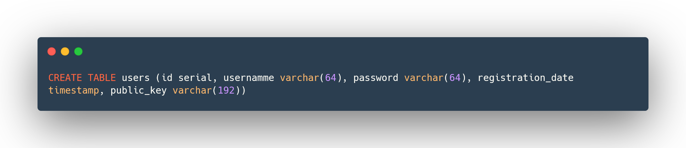

# Database scheme {style=text-align:center}

Here are schemes for tables in your database so you will be able to quickly create this in your environment.

### Users {style=text-align:center}

```postgres
CREATE TABLE users (id serial, username varchar(64), password varchar(64),
registration_date timestamp, public_key varchar(192))
```

### Cookies {style=text-align:center}

```postgres
CREATE TABLE cookies (id serial, cookie_value varchar(64), user_id int, remember_me bool)
```

### Quick To Do {style=text-align:center}

```postgres
CREATE TABLE quicktodo (id serial, user_id int, iv text, encryptedlist text)
```