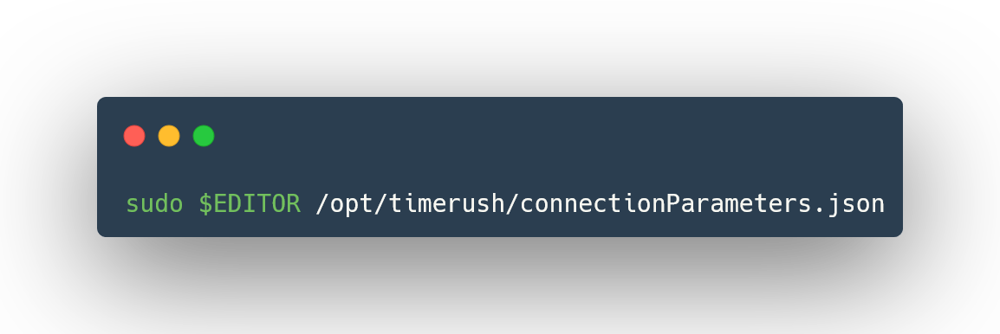

# Baremetal
1. Create folder for project:

  ```bash
  sudo mkdir -p /opt/timerush
  sudo chown -R 1000:1000 /opt/timerush # Replace it with your id or username
  chmod 750 -R /opt/timerush
  ```
2. Clone repository:

  ```bash
  git clone https://github.com/Mnichus3142/Time-Rush.git /opt/timerush
  ```
3. Open *src/connectionParameters.json* and enter data used for connection (don't worry if you don't have SSL certificate, just leave this field blank:

  ```bash
  $EDITOR /opt/timerush/src/connectionParameters.json
  ```
4. [Create Database](database/scheme.md)
5. Run it in desired way:

| Run locally (dev) | Run locally (build) |
| ------------- | ------------- |
| 1. cd to app dir | 1. npm run build |
| 2. npm run dev | 2. 🚧WIP🚧 |

# Docker
**Disclaimer:** for now docker is running preview version, there are work in progress to change it

You can get image from [there](https://hub.docker.com/repository/docker/michus3142/timerush/general), or build it by yourself:

```
(sudo) docker build . -t timerush
```
## Prework
You need to do this for both methods:
1. First of all, create some folder for project e.g.:

```
sudo mkdir -p /opt/timerush
```
2. while inside that directory create and edit *connectionParameters.json* with your favourite editor:

```
sudo $EDITOR /opt/timerush/connectionParameters.json
```
3. and add basic structure to it and fill database creditials:

```json
{
    "user": "",
    "host": "",
    "database": "timerush",
    "password": "",
    "port": 14956,
    "ssl": {
        "ca": ""
    }
}
```
4. Last but not least you need to [follow](https://github.com/Mnichus3142/Time-Rush/blob/main/docs/database/scheme.md) this guide.

## Stadalone container
1. You can run container by using the following command(after of course replacing YOUR_IP and YOUR_PORT with your own, probably *127.0.01:4173*):

```
(sudo) docker run \
-p {YOUR_IP}:{YOUR_PORT}:4173 \
-v ./connectionParameters.json:/home/node/time-rush/src/connectionParameters.json \
michus3142/timerush:V0.1-Alpha
```
## Docker compose
1. First, you need to get compose file:

```bash
wget https://raw.githubusercontent.com/Mnichus3142/Time-Rush/refs/heads/main/src/connectionParameters.json
```
2. and run it:

```bash
(sudo) docker compose up -d
```
or(for compose V1):

```bash
(sudo) docker-compose up -d
```
